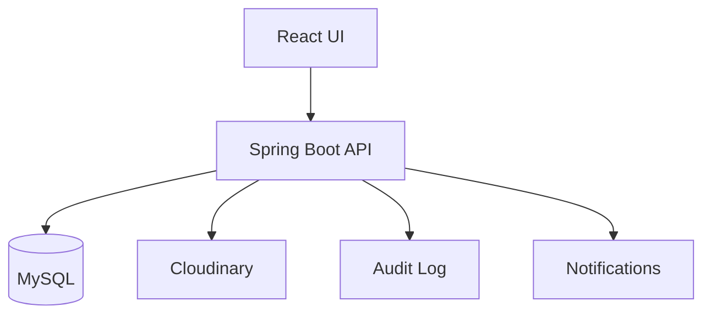

# Architecture

HRMS uses a modular monolith architecture. Each business module owns its controller, service, repository, entity, DTO, and validation code, but everything deploys as one Spring Boot application.

## Backend Layers

- Controller: HTTP endpoints and request/response mapping
- Service: business rules, transactions, and orchestration
- Repository: persistence and query execution
- Entity: relational MySQL model
- DTO: API contract and validation boundary

## Main Modules

- auth
- employee
- department
- designation
- attendance
- leave
- payroll
- recruitment
- performance
- document
- notification
- audit
- dashboard

## Integration Flow

## Design Principles

- Keep controllers thin.
- Keep business logic in services.
- Use DTOs instead of exposing entities.
- Use transactions for state changes.
- Use specifications for employee search.
- Use Cloudinary through a storage abstraction.
- Use JWT access and refresh tokens for authentication.
