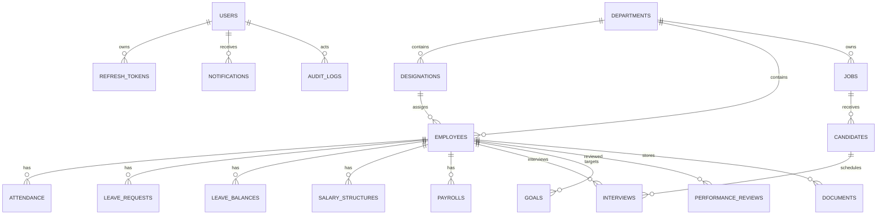

# Database Schema

The application uses a normalized MySQL 8 schema with foreign keys, indexes, timestamps, and soft-delete/lifecycle handling where appropriate.

## Key Tables

- `users` - application accounts and roles
- `refresh_tokens` - refresh token rotation and logout support
- `departments` - department master data
- `designations` - designations linked to departments
- `employees` - employee profile and employment data
- `attendance` - daily attendance records
- `leave_requests` - leave workflow records
- `leave_balances` - employee leave balance per type
- `salary_structures` - salary setup per employee
- `payrolls` - monthly payroll snapshots
- `jobs` - recruitment openings
- `candidates` - candidate records and pipeline status
- `interviews` - interview scheduling and status
- `goals` - employee goals
- `performance_reviews` - review records
- `documents` - Cloudinary metadata
- `notifications` - persistent notifications
- `audit_logs` - action history

## Important Relationships

- employee -> department
- employee -> designation
- employee -> manager
- attendance -> employee
- leave_request -> employee
- leave_balance -> employee
- salary_structure -> employee
- payroll -> employee
- job -> department
- candidate -> job
- interview -> candidate
- interview -> interviewer(employee)
- goal -> employee and manager(employee)
- performance_review -> employee and manager(employee)
- document -> employee
- notification -> user

## Notes

- Unique constraints exist for employee email and employee ID.
- Attendance uses a unique employee/date pair.
- Leave requests enforce status transitions in the service layer.
- Payroll records are unique per employee and payroll month.
- Document metadata stores Cloudinary identifiers only, not file blobs.

## ER Diagram

